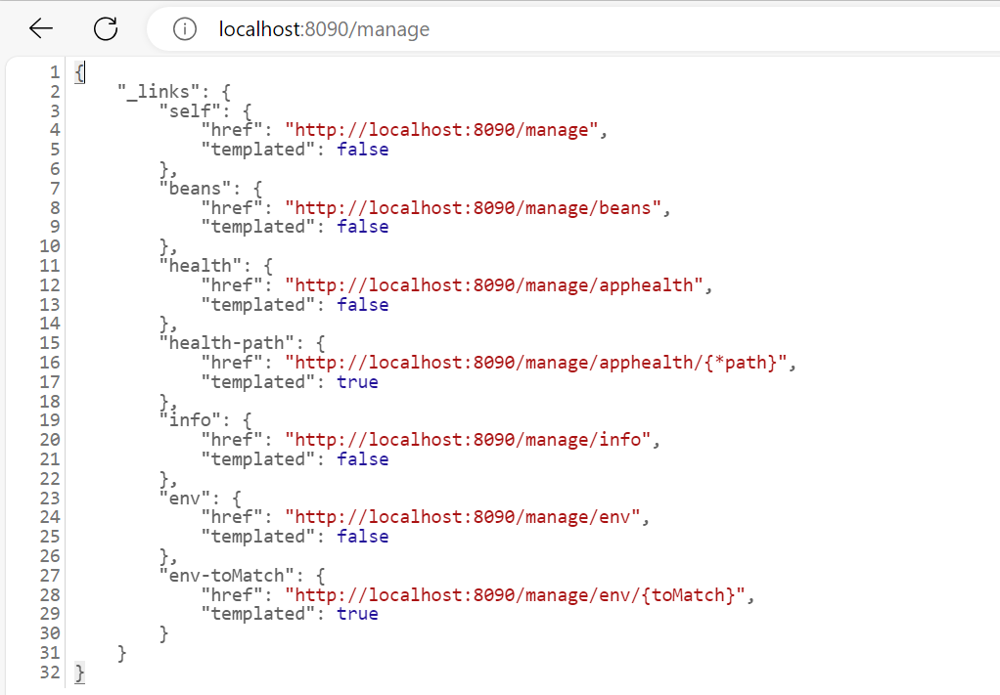

# actuatorDemo
This project is for basic understanding of actuator implementation in spring boot microservices. 

1. To update the actuator endpoint port alone 

 <i>management.server.port = 8090</i>  
eg: http://localhost:8090/actuator 

2. To expose additional predefined endpoints of actuator, by default health endpoint is exposed 

 <i>management.endpoints.web.exposure.include = env,info,beans,health</i>  
eg:  
http://localhost:8090/actuator/env  
http://localhost:8090/actuator/info  
http://localhost:8090/actuator/beans  
http://localhost:8090/actuator/health

3. To update the base path (or) endpoint of the actuator  

<i>management.endpoints.web.base-path = /manage</i>  
eg: http://localhost:8090/manage

4. To update the endpoint value  

health endpoint "/health" is changed to "/apphealth"  
<i>management.endpoints.web.path-mapping.health = apphealth </i> 
eg: http://localhost:8090/manage/apphealth

